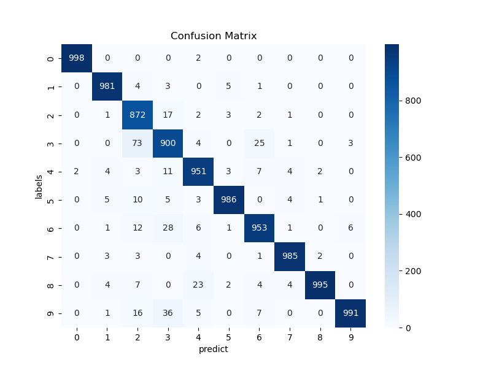
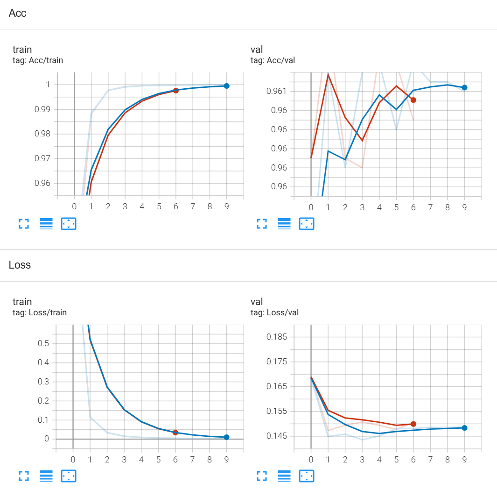

# text-classify
an exercise
* The dataset is too large to upload. Please download on your own and put it in main. 
## 1.use TF-IDF to process the text.
### train
run <br />
```
python train.py --train_file YOUR_TRAIN_FILE_PATH --val_file YOUR_VAL_FILE_PATH --num_epochs NUM_EPOCHS --batch_size BATCH_sIZE --lr LEARNING_RATE
```
<br/>

for example:  <br/>
```python
python train.py --train_file ./train.tsv --val_file ./test.tsv --num_epochs 50 --batch_size 128 --lr 0.001
```
<br/>

### predict
run <br/>
```
python predict.py --file_path YOUR_PREDICT_FILE_PATH --model_path YOUR_MODEL_PATH --output_dir OUTPUT_DIRCTORY_PATH
```
<br/>

for example: <br/>
```python
python predict.py --file_path ./small_test.tsv --model_path D:\CC\
数据集\checkpoint\model_epoch50_ValLoss1.82574892.pth --output_dir ./predict
```
<br/>

after predict, confusion_matrix will be saved.

### visualize
run 
```
tensorboard --logdir=runs/
```
After running ,if you see information like this 'TensorBoard 2.16.2 at http://localhost:6006/ (Press CTRL+C to quit)', then you success. Open this link to get results.
<br/>
Here, you will see the loss and accuracy curve of train dataset and validation dataset, and also the confusion matrix of prediction dataset(after you run 'predict.py').
<br/>

### result
best Train Acc:0.99994, Val Acc:0.96080
model saved to model_epoch35_ValLoss0.18576954506317656.pth
<br/>


Another two versions.


## 2. use word2vec model to classify.
run w2vec_model.py
<br/>

Train acc:0.9945, Test acc:0.9329
confusion matrix:
```
[[991   0   1   0   1   2   0   2   3   0]
 [  0 975   3   0   4   4   0   7   7   0]
 [  0   3 808  59  12  46  15   4  28  25] 
 [  2   6  10 828   6  12  38   1  12  85] 
 [  1   4   3   3 885   2  35   7  50  10] 
 [  0   8  21   0   5 962   0   2   1   1]
 [  0   2   0  19   6   0 942   1  19  11] 
 [  0   0   3   1   8  11   1 962  12   2] 
 [  0   0   4   0   2   3   1   3 987   0]
 [  0   0   0   4   1   0   6   0   0  989]] 
```

use network with convolution:
Train acc:0.9895, Test acc:0.9337.
confusion matrix:
```
[[990   0   1   0   2   2   1   3   1   0]
 [  0 968   2   1   5   9   4   7   2   2]
 [  0   4 743 133   7  54  20   8   9  22]
 [  0   5  11 890   8  12  30   3   4  37]
 [  1   3   5   2 905   3  17  16  36  12]
 [  1   5   7   1   8 976   0   0   1   1]
 [  0   3   2  38   5   0 935   1   9   7]
 [  0   1   2   0   5   7   0 978   6   1]
 [  0   0   4   1   3   2   0   9 980   1]
 [  0   0   0  21   0   0   7   0   0 972]]
```
