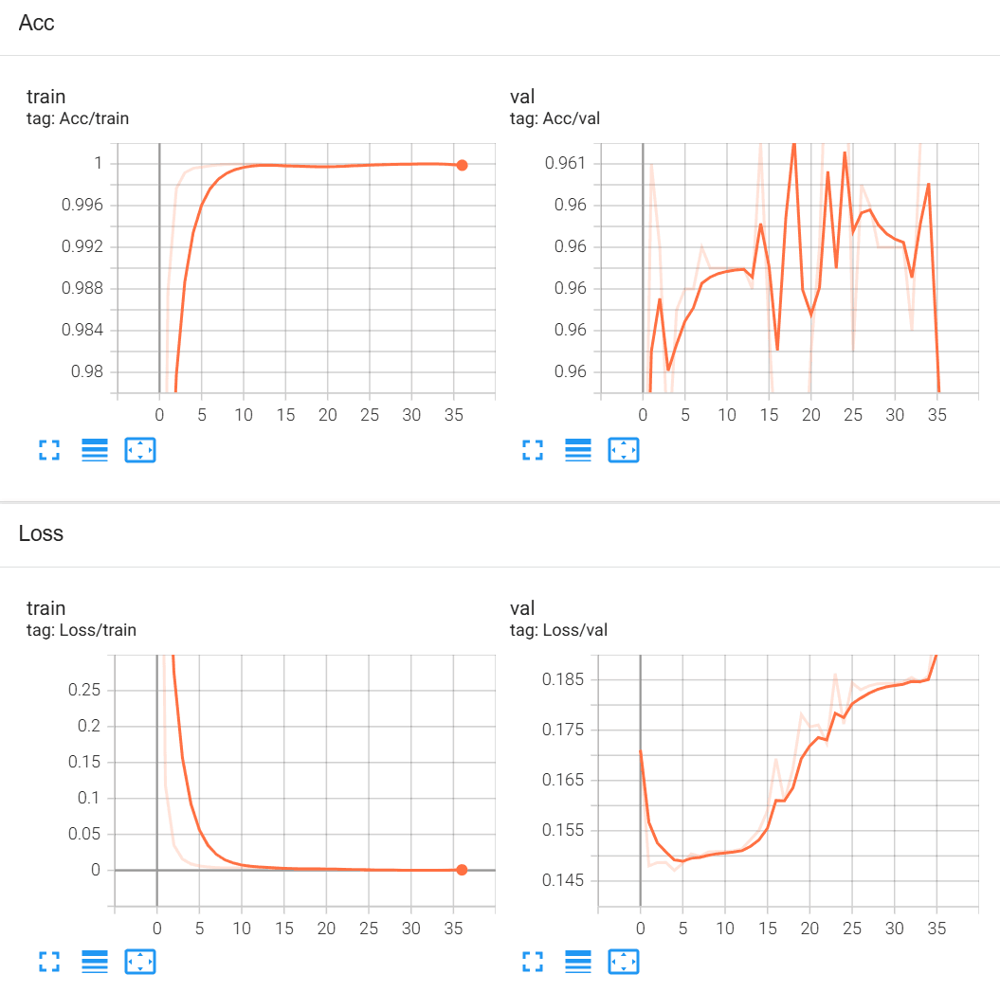

# text-classify
a small exercise

## train
run <br />
```
python train.py --train_file YOUR_TRAIN_FILE_PATH --val_file YOUR_VAL_FILE_PATH --num_epochs NUM_EPOCHS --batch_size BATCH_sIZE --lr LEARNING_RATE
```
<br/>

for example:  <br/>
```python
python train.py --train_file ./train.tsv --val_file ./test.tsv --num_epochs 50 --batch_size 128 --lr 0.001
```
<br/>

## predict
run <br/>
```
python predict.py --file_path YOUR_PREDICT_FILE_PATH --model_path YOUR_MODEL_PATH --output_dir OUTPUT_DIRCTORY_PATH
```
<br/>

for example: <br/>
```python
python predict.py --file_path ./small_test.tsv --model_path D:\CC\
数据集\checkpoint\model_epoch50_ValLoss1.82574892.pth --output_dir ./predict
```
<br/>

## visualize
run 
```
tensorboard --logdir=runs/
```
After running ,if you see information like this 'TensorBoard 2.16.2 at http://localhost:6006/ (Press CTRL+C to quit)', then you success. Open this link to get results.
<br/>
Here, you will see the loss and accuracy curve of train dataset and validation dataset, and also the confusion matrix of prediction dataset(after you run 'predict.py').
<br/>

## result
best Train Loss:0.00028, Train Acc:0.99994, Val Loss:0.18577, Val Acc:0.96070
model saved to model_epoch35_ValLoss0.18576954506317656.pth
<br/>


